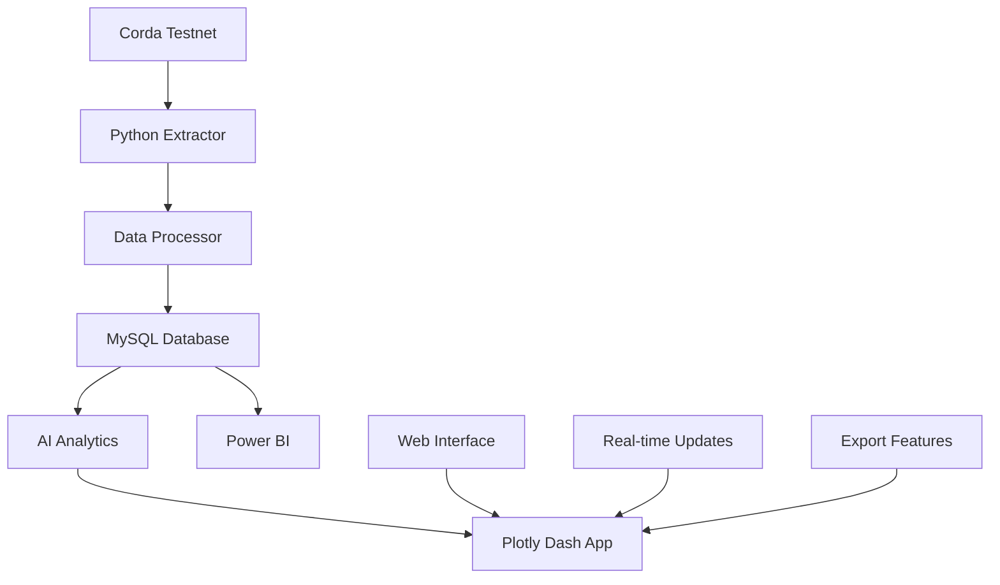

# 🚀 Blockchain Analytics Platform

<div align="center">


**Plataforma completa de análisis de datos blockchain con capacidades de IA integradas**

[](https://github.com/CarlosAHP/blockchain)
[](https://github.com/CarlosAHP/blockchain)

</div>

---

## 🎯 ¿Qué es este proyecto?

Esta plataforma te permite **analizar datos de blockchain de manera inteligente** utilizando:

- 🔗 **Extracción de datos** de redes blockchain (Corda testnet)
- 🧠 **Inteligencia Artificial** para detectar anomalías y hacer predicciones
- 📊 **Visualizaciones interactivas** con Plotly Dash
- 🗄️ **Almacenamiento optimizado** en MySQL
- 📈 **Dashboards profesionales** con Power BI

## ✨ Características Principales

### 🤖 Inteligencia Artificial Integrada
- **Detección de anomalías** con Isolation Forest
- **Predicciones de volumen** con regresión lineal
- **Análisis de patrones** temporales automáticos
- **Insights inteligentes** generados automáticamente

### 📊 Visualizaciones Avanzadas
- **Dashboards interactivos** en tiempo real
- **Gráficos dinámicos** con Plotly
- **Filtros inteligentes** por fecha, tipo, volumen
- **Exportación** a múltiples formatos

### 🔄 Pipeline Automatizado
- **Extracción automática** de datos blockchain
- **Procesamiento inteligente** con Pandas
- **Carga optimizada** a MySQL
- **Análisis continuo** con IA

## 🚀 Inicio Rápido

### 1️⃣ Clonar el Repositorio
```bash
git clone https://github.com/CarlosAHP/blockchain.git
cd blockchain
```

### 2️⃣ Instalar Dependencias
```bash
pip install -r requirements.txt
```

### 3️⃣ Configurar Base de Datos
```bash
# Crear usuario y base de datos en MySQL
mysql -u root -p
```

```sql
CREATE USER 'blockchainuser'@'localhost' IDENTIFIED BY '1234';
CREATE DATABASE blockchain_analytics CHARACTER SET utf8mb4 COLLATE utf8mb4_unicode_ci;
GRANT ALL PRIVILEGES ON blockchain_analytics.* TO 'blockchainuser'@'localhost';
FLUSH PRIVILEGES;
```

### 4️⃣ Ejecutar la Aplicación
```bash
# Opción 1: Pipeline completo (recomendado)
python main.py

# Opción 2: Aplicación web interactiva
python app.py

# Opción 3: Aplicación simple
python app_simple.py
```

## 🎮 Cómo Usar la Aplicación

### 🌐 Aplicación Web Interactiva
1. Ejecuta `python app.py`
2. Abre tu navegador en `http://localhost:8050`
3. Explora los dashboards interactivos
4. Usa los filtros para análisis específicos

### 📊 Dashboards Disponibles

#### 📈 Dashboard Principal
- **Métricas en tiempo real**: Transacciones, volumen, gas
- **Análisis temporal**: Tendencias por día/semana/mes
- **Top performers**: Direcciones y contratos más activos
- **Alertas de IA**: Anomalías y predicciones

#### 🔍 Dashboard de Análisis
- **Distribución de transacciones**: Por tipo y valor
- **Análisis de gas**: Utilización y precios
- **Métricas de red**: Salud y rendimiento
- **Insights de IA**: Patrones y predicciones

### 🤖 Funciones de IA

#### Detección de Anomalías
```python
# El sistema automáticamente detecta:
- Días con actividad inusual
- Picos en transacciones o volumen
- Cambios en patrones de gas
- Comportamientos sospechosos
```

#### Predicciones Inteligentes
```python
# Predice automáticamente:
- Volumen de transacciones futuras
- Precios de gas
- Actividad de contratos
- Tendencias de red
```

## 🏗️ Arquitectura del Sistema



## 📁 Estructura del Proyecto

```
blockchain/
├── 🚀 main.py                    # Pipeline principal
├── 🌐 app.py                     # Aplicación web completa
├── 🎯 app_simple.py             # Aplicación web simple
├── ⚙️ config.py                 # Configuración
├── 🗄️ database_setup.py         # Setup de MySQL
├── 📊 data_processor.py          # Procesamiento de datos
├── 🤖 ai_analytics.py           # Análisis de IA
├── 📈 create_dashboards.py      # Generador de dashboards
├── 📋 requirements.txt          # Dependencias
└── 📁 data/                      # Datos del proyecto
    ├── raw/                      # Datos originales
    ├── processed/                # Datos procesados
    └── csv/                      # Archivos CSV
```

## 🔧 Comandos Útiles

### Ejecutar Componentes Individuales
```bash
# Solo extracción de datos
python corda_data_extractor.py

# Solo procesamiento
python data_processor.py

# Solo análisis de IA
python ai_analytics.py

# Solo dashboards
python create_dashboards.py
```

### Configuración de Base de Datos
```bash
# Configurar MySQL
python database_setup.py

# Cargar datos a MySQL
python mysql_loader.py
```

## 📊 Métricas y KPIs

### 📈 Métricas de Transacciones
- **Volumen total diario**
- **Número de transacciones**
- **Precio promedio de gas**
- **Tiempo de confirmación**

### 🌐 Métricas de Red
- **Utilización de gas**
- **Tamaño promedio de bloques**
- **Número de direcciones activas**
- **Nuevos contratos desplegados**

### 🤖 Métricas de IA
- **Número de anomalías detectadas**
- **Precisión de predicciones**
- **Confianza en insights**
- **Tendencias identificadas**

## 🔧 Configuración Avanzada

### Variables de Entorno
```bash
# Crear archivo .env
DB_HOST=localhost
DB_USER=blockchainuser
DB_PASSWORD=1234
DB_NAME=blockchain_analytics
DB_PORT=3306
```

### Configuración de MySQL
```sql
-- Optimizar para análisis
SET GLOBAL innodb_buffer_pool_size = 1G;
SET GLOBAL query_cache_size = 256M;
SET GLOBAL max_connections = 200;
```

## 🚨 Solución de Problemas

### ❌ Error de Conexión a MySQL
```bash
# Verificar que MySQL esté ejecutándose
sudo systemctl status mysql

# Verificar credenciales
mysql -u blockchainuser -p1234 -h localhost blockchain_analytics
```

### ❌ Error de Dependencias
```bash
# Reinstalar dependencias
pip install --upgrade -r requirements.txt

# Crear entorno virtual
python -m venv venv
source venv/bin/activate  # Linux/Mac
# o
venv\Scripts\activate     # Windows
```

### ❌ Error de Permisos
```bash
# Crear directorios manualmente
mkdir -p data/raw data/processed data/csv
chmod 755 data/raw data/processed data/csv
```

## 🎯 Casos de Uso

### 🔍 Para Analistas de Datos
- **Análisis de tendencias** blockchain
- **Detección de patrones** anómalos
- **Predicciones de mercado**
- **Reportes automatizados**

### 🏢 Para Empresas
- **Monitoreo de transacciones**
- **Análisis de riesgo**
- **Optimización de gas**
- **Compliance y auditoría**

### 👨‍💻 Para Desarrolladores
- **API de análisis** blockchain
- **Integración con sistemas** existentes
- **Automatización de procesos**
- **Desarrollo de dashboards**

## 🚀 Próximas Mejoras

- [ ] 🔗 **Integración con más blockchains** (Ethereum, Bitcoin)
- [ ] 🐳 **Dockerización** completa del proyecto
- [ ] 🌐 **API REST** para consultas externas
- [ ] 📱 **Aplicación móvil** para monitoreo
- [ ] 🔔 **Alertas en tiempo real** por email/SMS
- [ ] 🧠 **Más algoritmos de ML** (LSTM, Random Forest)
- [ ] ☁️ **Despliegue en la nube** (AWS, Azure, GCP)

## 🤝 Contribuir

¡Las contribuciones son bienvenidas! Por favor:

1. 🍴 Fork el proyecto
2. 🌿 Crea una rama para tu feature (`git checkout -b feature/AmazingFeature`)
3. 💾 Commit tus cambios (`git commit -m 'Add some AmazingFeature'`)
4. 📤 Push a la rama (`git push origin feature/AmazingFeature`)
5. 🔄 Abre un Pull Request

## 📄 Licencia

Este proyecto está bajo la Licencia MIT. Ver `LICENSE` para más detalles.

## 👨‍💻 Autor

**Carlos AHP**
- GitHub: [@CarlosAHP](https://github.com/CarlosAHP)
- LinkedIn: [Carlos AHP](https://linkedin.com/in/carlosahp)

## 🙏 Agradecimientos

- **Corda Network** por la red testnet
- **Plotly** por las visualizaciones interactivas
- **scikit-learn** por las capacidades de ML
- **MySQL** por el almacenamiento robusto
- **Power BI** por los dashboards profesionales

---

<div align="center">

### ⭐ Si te gusta este proyecto, ¡dale una estrella! ⭐

[](https://github.com/CarlosAHP/blockchain)

**Desarrollado con ❤️ para la comunidad blockchain**

</div>